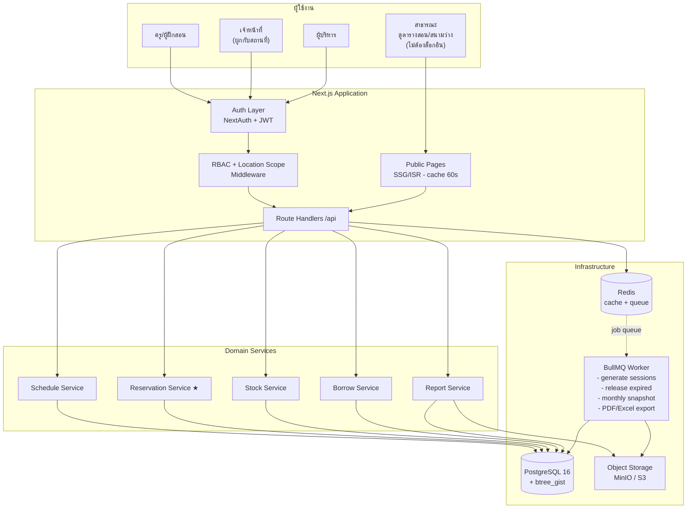
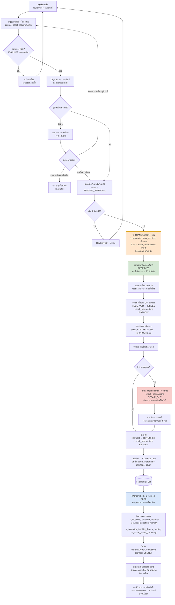
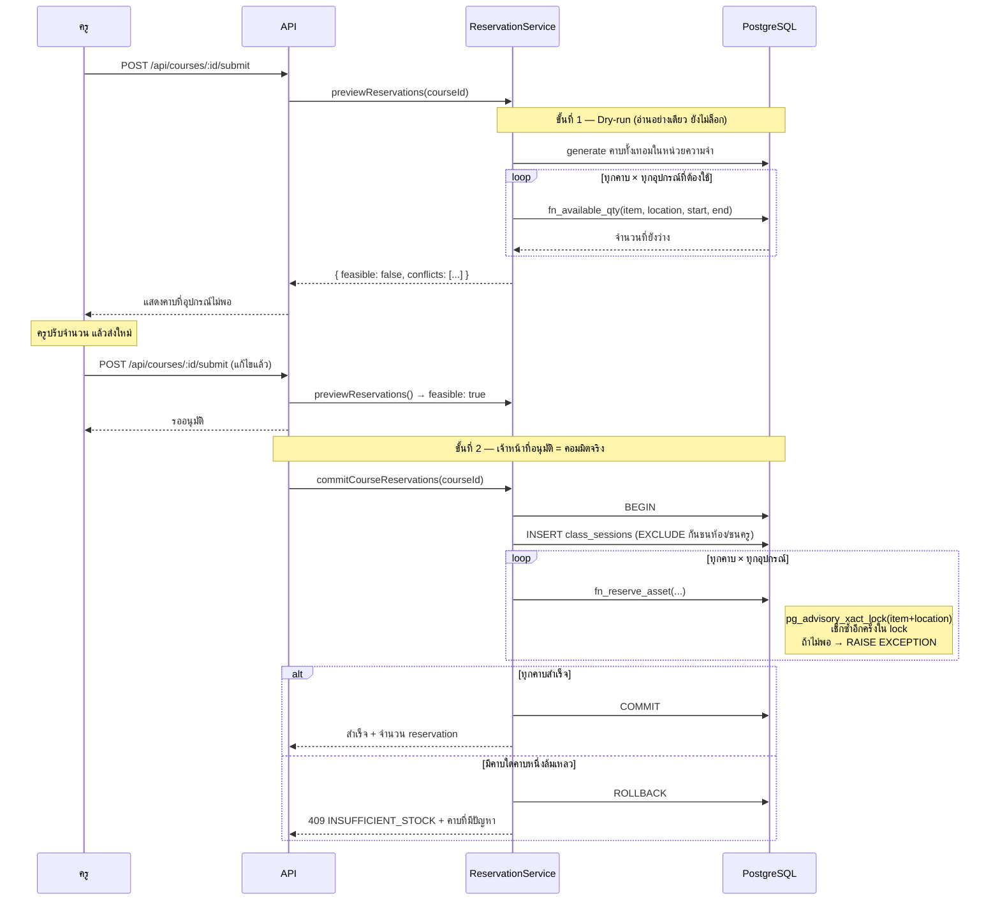

# System Architecture — ระบบบริหารจัดการศูนย์กีฬารวม
## Sports Center Management System (Schedule + Assets + Executive Report)

---

## 1. ภาพรวมสถาปัตยกรรม



**หลักการ 3 ข้อ**

1. **หน้าสาธารณะแยกออกจากระบบหลังบ้านโดยสิ้นเชิง** — ตารางสอนและสถานะสนามใช้ ISR (cache 60 วินาที) ไม่แตะฐานข้อมูลทุก request เพราะช่วงเปิดเทอมจะมีนักเรียนเข้าดูพร้อมกันหลายร้อยคน
2. **ทุกการเปลี่ยนแปลงสต็อกต้องผ่าน `stock_transactions`** — ไม่มีโค้ดส่วนไหน UPDATE `stock_balances` ตรง ๆ ได้ ทำให้ยอดตรวจสอบย้อนหลังได้เสมอ
3. **งานหนักทั้งหมดไปที่ Worker** — การ generate คาบเรียนทั้งเทอม (คอร์สละ ~18 คาบ × หลายสิบคอร์ส) และการ export PDF/Excel ต้องไม่ block HTTP request

---

## 2. สิทธิ์การเข้าถึง (RBAC + Location Scope)

| ความสามารถ | Public | Student | Instructor | Staff | Admin | Executive |
|---|:-:|:-:|:-:|:-:|:-:|:-:|
| ดูตารางสอน / สนามว่าง | ✔ | ✔ | ✔ | ✔ | ✔ | ✔ |
| ดูสต็อกอุปกรณ์ (จำนวนคงเหลือ) | ✔ | ✔ | ✔ | ✔ | ✔ | ✔ |
| จองคาบเรียน / จองสนาม | ✘ | ✔ | ✔ | ✔ | ✔ | ✘ |
| สร้าง/แก้ไขคอร์สและตารางสอนของตนเอง | ✘ | ✘ | ✔ | ✔ | ✔ | ✘ |
| จัดตารางสอนภาพรวมทุกคน | ✘ | ✘ | ✘ | ✔ | ✔ | ✘ |
| ยื่นคำขอยืมครุภัณฑ์ | ✘ | ✔ | ✔ | ✔ | ✔ | ✘ |
| อนุมัติ / จ่ายของ / รับคืน | ✘ | ✘ | ✘ | ✔※ | ✔ | ✘ |
| จัดการสต็อก เพิ่ม/แก้ไขครุภัณฑ์ | ✘ | ✘ | ✘ | ✔※ | ✔ | ✘ |
| บันทึกชำรุดหลังจบคาบ | ✘ | ✘ | ✔ | ✔ | ✔ | ✘ |
| Dashboard + รายงานผู้บริหาร | ✘ | ✘ | ✘ | ✔ | ✔ | ✔ |
| จัดการผู้ใช้และสิทธิ์ | ✘ | ✘ | ✘ | ✘ | ✔ | ✘ |

**※ Location Scope** — เจ้าหน้าที่เห็นและจัดการได้เฉพาะสถานที่ที่ผูกไว้ในตาราง `user_locations` เท่านั้น เช่น เจ้าหน้าที่สระว่ายน้ำจะเห็นสต็อกและคำขอยืมของสระว่ายน้ำ ไม่เห็นของห้องเทควันโด

การบังคับใช้ทำ **2 ชั้น** เพื่อกันการหลุด:

```ts
// ชั้นที่ 1 — Middleware ตรวจ permission code
requirePermission('borrow.approve')

// ชั้นที่ 2 — ทุก query ที่แตะข้อมูลรายสถานที่ ต้องผ่าน scope filter เสมอ
function scopeLocations(session: Session) {
  if (session.role === 'ADMIN') return undefined;          // ไม่จำกัด
  return { locationId: { in: session.allowedLocationIds } };
}
```

**ผู้บริหารเป็น read-only ระดับฐานข้อมูล** — ใช้ DB role แยกที่มีสิทธิ์ `SELECT` เฉพาะ views `v_*` เท่านั้น ป้องกันความผิดพลาดจากบั๊กในโค้ด

---

## 3. Flowchart: ครูเปิดคอร์ส → ล็อกครุภัณฑ์ → ออกรายงาน

### 3.1 ภาพรวมทั้งวงจร



### 3.2 ลำดับการทำงานตอน "เช็กและล็อกครุภัณฑ์" (จุดที่ยากที่สุด)



**ทำไมต้องเช็ก 2 รอบ (dry-run แล้วเช็กซ้ำใน lock)?**
ระหว่างที่ครูดูผล dry-run แล้วกดยืนยัน อาจมีครูอีกคนจองอุปกรณ์ชุดเดียวกันไปแล้ว การเช็กซ้ำภายใน `pg_advisory_xact_lock` จึงเป็นด่านสุดท้ายที่รับประกันว่าไม่มีการจองเกินจำนวนจริง — และล็อกเฉพาะคู่ `item + location` ไม่ล็อกทั้งตาราง ระบบจึงยังรองรับการจองพร้อมกันของอุปกรณ์คนละชนิดได้

---

## 4. Technology Stack

| ชั้น | เลือกใช้ | เหตุผลที่เหมาะกับโครงการนี้ |
|---|---|---|
| **Frontend + Backend** | **Next.js 15 (App Router) + TypeScript** | ทีมเดียวดูแลทั้งระบบ · Server Components ช่วยให้หน้าตารางสอนสาธารณะเร็วมากด้วย ISR · Server Actions ตัดโค้ด API ซ้ำซ้อนสำหรับฟอร์มหลังบ้าน |
| **Database** | **PostgreSQL 16** | จำเป็น ไม่ใช่แค่ชอบ — `EXCLUDE USING gist` กันจองชนกันได้ที่ระดับฐานข้อมูล, `tstzrange` คำนวณช่วงเวลาทับซ้อน, advisory lock กัน race condition, JSONB เก็บ snapshot รายงาน · MySQL ทำ 3 อย่างแรกไม่ได้เลย |
| **ORM** | **Prisma 6** (+ raw SQL สำหรับ reservation/report) | type-safe กับ TypeScript · แต่ logic การจองและรายงานใช้ `$queryRaw` เรียก function/view ที่เขียนไว้ใน SQL โดยตรง เพราะ ORM ทำ range overlap ได้ไม่ดี |
| **Auth** | **NextAuth v5 (Auth.js)** + Credentials + Google Workspace | โรงเรียนมี Google Workspace อยู่แล้ว (`@teacher.act.ac.th`) ครูล็อกอินด้วยบัญชีเดิมได้ ไม่ต้องจำรหัสใหม่ |
| **State / Data fetching** | TanStack Query v5 | จัดการ cache + optimistic update ตอนจ่ายของหน้าสโตร์ |
| **UI** | Tailwind CSS + shadcn/ui | ปรับ responsive ง่าย เจ้าหน้าที่ใช้มือถือสแกน QR ที่หน้าสโตร์เป็นหลัก |
| **ปฏิทินตารางสอน** | FullCalendar v6 (resource timeline) | มุมมอง "สถานที่ × เวลา" ที่ต้องการพอดี ไม่ต้องเขียนเอง |
| **Queue / Scheduler** | BullMQ + Redis | generate คาบทั้งเทอม, ปล่อย reservation หมดอายุ, snapshot รายเดือน, export |
| **Cache** | Redis | cache หน้าสาธารณะและผล dashboard |
| **PDF** | Playwright (render HTML → PDF) | ต้องพิมพ์ใบตรวจนับ/ใบยืมภาษาไทยให้ฟอนต์ถูกต้อง — HTML → PDF คุมได้ดีที่สุด ใช้ฟอนต์ Sarabun |
| **Excel** | ExcelJS | รายงานผู้บริหารหลายชีต + กราฟ |
| **QR / Barcode** | `qrcode` (สร้าง) + `html5-qrcode` (สแกนผ่านกล้อง) | |
| **File Storage** | MinIO (on-prem) หรือ S3 | รูปสภาพอุปกรณ์ก่อน-หลังยืม เป็นหลักฐานเวลามีข้อพิพาท |
| **Deploy** | Docker Compose บนเซิร์ฟเวอร์โรงเรียน | ข้อมูลครุภัณฑ์เป็นทรัพย์สินราชการ แนะนำ on-prem · ถ้าเลือก cloud ใช้ Vercel + Neon/Supabase ได้ |
| **Monitoring** | Sentry + pino | |

**ทางเลือกที่พิจารณาแล้วไม่เลือก**
- *NestJS แยก backend* — แยกได้ แต่เพิ่มงาน deploy และ type sharing โดยไม่จำเป็นสำหรับระบบภายในองค์กรขนาดนี้ ถ้าอนาคตต้องทำแอปมือถือ native ค่อยแยก API ออกมา
- *MySQL/MariaDB* — คุ้นเคยกว่าสำหรับ hosting โรงเรียน แต่ต้องเขียน logic กันจองชนใน application layer เอง ซึ่งพลาดง่ายกว่ามาก
- *Firebase* — ไม่เหมาะ เพราะระบบนี้เป็น relational จัด ๆ และต้องการ transaction ข้ามหลายตาราง

---

## 5. โครงสร้างโปรเจกต์ (Folder Structure)

```
sports-center/
├─ docker-compose.yml
├─ .env.example
├─ turbo.json
├─ pnpm-workspace.yaml
│
├─ apps/
│  ├─ web/                                  # Next.js — ทั้ง UI และ API
│  │  ├─ src/
│  │  │  ├─ app/
│  │  │  │  ├─ (public)/                    # ไม่ต้องล็อกอิน — ISR
│  │  │  │  │  ├─ page.tsx                  # หน้าแรก
│  │  │  │  │  ├─ schedule/page.tsx         # ตารางสอนรวม
│  │  │  │  │  ├─ schedule/[locationCode]/page.tsx
│  │  │  │  │  ├─ instructors/[id]/page.tsx # ตารางสอนรายครู
│  │  │  │  │  └─ facilities/page.tsx       # สถานะสนาม/อุปกรณ์ที่เปิดจอง
│  │  │  │  │
│  │  │  │  ├─ (auth)/
│  │  │  │  │  ├─ login/page.tsx
│  │  │  │  │  └─ register/page.tsx
│  │  │  │  │
│  │  │  │  ├─ (instructor)/
│  │  │  │  │  ├─ my-schedule/page.tsx
│  │  │  │  │  ├─ courses/page.tsx
│  │  │  │  │  ├─ courses/new/page.tsx      # สร้างคอร์ส + ผูกอุปกรณ์
│  │  │  │  │  ├─ courses/[id]/assets/page.tsx
│  │  │  │  │  ├─ sessions/[id]/page.tsx    # หน้าคาบเรียน: เช็คชื่อ/รับของ
│  │  │  │  │  └─ sessions/[id]/close/page.tsx  # ปิดคาบ + แจ้งชำรุด
│  │  │  │  │
│  │  │  │  ├─ (staff)/
│  │  │  │  │  ├─ dashboard/page.tsx
│  │  │  │  │  ├─ inventory/page.tsx
│  │  │  │  │  ├─ inventory/[itemId]/page.tsx
│  │  │  │  │  ├─ scan/page.tsx             # สแกน QR จ่าย/รับคืน
│  │  │  │  │  ├─ borrow-requests/page.tsx
│  │  │  │  │  ├─ maintenance/page.tsx
│  │  │  │  │  ├─ schedule-master/page.tsx  # ตารางสอนภาพรวม
│  │  │  │  │  └─ inventory-count/page.tsx  # ตรวจนับประจำปี
│  │  │  │  │
│  │  │  │  ├─ (executive)/
│  │  │  │  │  ├─ dashboard/page.tsx
│  │  │  │  │  └─ reports/
│  │  │  │  │     ├─ monthly/page.tsx
│  │  │  │  │     ├─ utilization/page.tsx
│  │  │  │  │     └─ teaching-hours/page.tsx
│  │  │  │  │
│  │  │  │  ├─ (admin)/
│  │  │  │  │  ├─ users/page.tsx
│  │  │  │  │  ├─ roles/page.tsx
│  │  │  │  │  └─ locations/page.tsx
│  │  │  │  │
│  │  │  │  └─ api/
│  │  │  │     ├─ auth/[...nextauth]/route.ts
│  │  │  │     ├─ public/
│  │  │  │     │  ├─ schedule/route.ts
│  │  │  │     │  └─ facilities/route.ts
│  │  │  │     ├─ courses/
│  │  │  │     │  ├─ route.ts
│  │  │  │     │  └─ [id]/
│  │  │  │     │     ├─ preview-reservations/route.ts   # ★ dry-run
│  │  │  │     │     ├─ submit/route.ts
│  │  │  │     │     └─ approve/route.ts                # ★ commit
│  │  │  │     ├─ sessions/[id]/
│  │  │  │     │  ├─ issue-assets/route.ts
│  │  │  │     │  ├─ return-assets/route.ts
│  │  │  │     │  └─ report-damage/route.ts
│  │  │  │     ├─ inventory/
│  │  │  │     │  ├─ availability/route.ts              # ★ เช็กสต็อกตามช่วงเวลา
│  │  │  │     │  └─ transactions/route.ts
│  │  │  │     ├─ borrow/
│  │  │  │     └─ reports/
│  │  │  │        ├─ monthly/route.ts
│  │  │  │        └─ export/route.ts
│  │  │  │
│  │  │  ├─ modules/                        # โดเมนลอจิก แยกตามฟีเจอร์
│  │  │  │  ├─ auth/
│  │  │  │  │  ├─ rbac.ts                   # requirePermission, scopeLocations
│  │  │  │  │  └─ permissions.const.ts
│  │  │  │  ├─ schedule/
│  │  │  │  │  ├─ session-generator.ts      # แตก recurring → คาบรายวัน
│  │  │  │  │  └─ conflict-checker.ts
│  │  │  │  ├─ reservation/
│  │  │  │  │  ├─ reservation.service.ts    # ★ ไฟล์ที่แนบมา
│  │  │  │  │  └─ reservation.types.ts
│  │  │  │  ├─ inventory/
│  │  │  │  │  ├─ stock.service.ts          # ทุกการเคลื่อนไหวผ่านที่นี่
│  │  │  │  │  └─ maintenance.service.ts
│  │  │  │  ├─ borrow/
│  │  │  │  └─ report/
│  │  │  │     ├─ report.service.ts
│  │  │  │     ├─ pdf-renderer.ts
│  │  │  │     └─ excel-builder.ts
│  │  │  │
│  │  │  ├─ components/
│  │  │  │  ├─ ui/                          # shadcn
│  │  │  │  ├─ schedule/ScheduleCalendar.tsx
│  │  │  │  ├─ inventory/StockBadge.tsx
│  │  │  │  ├─ inventory/QrScanner.tsx
│  │  │  │  └─ report/UtilizationChart.tsx
│  │  │  │
│  │  │  ├─ lib/
│  │  │  │  ├─ db.ts                        # Prisma client (singleton)
│  │  │  │  ├─ redis.ts
│  │  │  │  ├─ queue.ts
│  │  │  │  └─ date.ts                      # จัดการ timezone Asia/Bangkok
│  │  │  │
│  │  │  └─ middleware.ts                   # ตรวจ session + role ก่อนเข้าทุก route
│  │  │
│  │  ├─ public/fonts/Sarabun/               # ฟอนต์ไทยสำหรับ PDF
│  │  └─ next.config.ts
│  │
│  └─ worker/                                # Background jobs
│     ├─ src/
│     │  ├─ index.ts
│     │  └─ jobs/
│     │     ├─ generate-sessions.job.ts       # แตกคาบทั้งเทอมเมื่อคอร์สอนุมัติ
│     │     ├─ release-expired.job.ts         # ทุก 15 นาที: ปล่อย reservation ที่เลยเวลา
│     │     ├─ overdue-check.job.ts           # ทุกวัน 08:00
│     │     ├─ monthly-snapshot.job.ts        # วันที่ 1 เวลา 02:00
│     │     └─ export-report.job.ts
│     └─ Dockerfile
│
├─ packages/
│  ├─ db/
│  │  ├─ prisma/schema.prisma
│  │  ├─ migrations/
│  │  │  ├─ 0001_init/migration.sql          # schema.sql
│  │  │  ├─ 0002_functions/migration.sql     # fn_available_qty, fn_reserve_asset
│  │  │  ├─ 0003_triggers/migration.sql
│  │  │  └─ 0004_views/migration.sql
│  │  └─ seed/
│  │     ├─ 01-master-data.ts                # หมวดหมู่ 16 + สถานที่ 18
│  │     └─ 02-import-legacy.ts              # นำเข้าจาก asset-import-template.xlsx
│  │
│  ├─ shared/
│  │  ├─ types/                              # type ที่ใช้ร่วม web + worker
│  │  ├─ schemas/                            # Zod validation
│  │  └─ constants/
│  │
│  └─ ui/                                    # component กลาง
│
└─ docs/
   ├─ schema.sql
   ├─ architecture.md
   └─ api-spec.yaml
```

---

## 6. จุดที่ต้องระวังเป็นพิเศษตอนพัฒนา

| ประเด็น | วิธีจัดการ |
|---|---|
| **Timezone** | เก็บเป็น `TIMESTAMPTZ` (UTC) ในฐานข้อมูล แปลงเป็น `Asia/Bangkok` ที่ชั้น presentation เท่านั้น — ถ้าเก็บเป็น local time การคำนวณช่วงเวลาทับซ้อนจะพังตอนข้ามวัน |
| **คาบเรียนย้อนหลัง** | ห้ามแก้ `class_sessions` ที่ `status = COMPLETED` เพราะรายงานเดือนที่ปิดงวดแล้วอ้างอิงอยู่ ถ้าต้องแก้จริงให้สร้าง adjustment record |
| **Reservation ค้าง** | คาบที่จบแล้วแต่ยังไม่มีการคืน จะถูก job `release-expired` เปลี่ยนเป็น `EXPIRED` หลังเลยเวลา 24 ชม. พร้อมแจ้งเตือนเจ้าหน้าที่ — ไม่ปล่อยให้ล็อกสต็อกค้างไว้ตลอดไป |
| **ปิดงวดรายงาน** | `monthly_report_snapshots.is_final = true` แล้วห้ามคำนวณใหม่ ผู้บริหารต้องเห็นตัวเลขเดียวกันทุกครั้งที่เปิดดู |
| **การนำเข้าข้อมูลเดิม** | ยอดตั้งต้นทั้งหมดนำเข้าเป็น `stock_transactions` ชนิด `RECEIVE` ไม่ใช่ UPDATE `stock_balances` ตรง ๆ เพื่อให้ ledger สมบูรณ์ตั้งแต่วันแรก |
| **ฟอนต์ไทยใน PDF** | ต้อง embed Sarabun ใน container ของ Playwright ไม่งั้นได้สี่เหลี่ยมทั้งหน้า |

---

## 7. ลำดับการพัฒนา (Sprint Plan)

| Sprint | ขอบเขต | Definition of Done |
|---|---|---|
| **1** (2 สัปดาห์) | DB migration + Auth + RBAC + Master data + นำเข้าข้อมูลเดิม | ล็อกอินได้ทุก role, เห็นทะเบียนครุภัณฑ์จริงจากไฟล์เดิม |
| **2** (2 สัปดาห์) | โมดูลสต็อก: รับเข้า/ปรับยอด/ย้าย/แจ้งชำรุด + QR | เจ้าหน้าที่ใช้แทน Google Sheets ได้แล้ว |
| **3** (3 สัปดาห์) | ตารางสอน: คอร์ส/ตาราง/generate คาบ + หน้าสาธารณะ | ครูสร้างคอร์สได้ นักเรียนดูตารางได้โดยไม่ล็อกอิน |
| **4** (3 สัปดาห์) | ★ Reservation + ยืม-คืน + ปิดคาบ/แจ้งชำรุด | ครูเปิดคอร์ส → ระบบล็อกอุปกรณ์อัตโนมัติครบวงจร |
| **5** (2 สัปดาห์) | รายงานผู้บริหาร + Dashboard + Export PDF/Excel | ผู้บริหารดึงรายงานเดือนที่แล้วได้เอง |
| **6** (2 สัปดาห์) | ตรวจนับประจำปี + แจ้งเตือน LINE + UAT | พิมพ์ใบตรวจนับรูปแบบเดิมได้ |

รวมประมาณ **14 สัปดาห์** สำหรับทีม 2-3 คน

---

## 8. ตัวอย่าง API ที่สำคัญที่สุด 3 เส้น

```http
### 1. เช็กว่าอุปกรณ์พอไหมในช่วงเวลาหนึ่ง (ใช้ทั้งหน้าครูและหน้าจองสนาม)
GET /api/inventory/availability
    ?itemId=42&locationId=7&start=2026-06-01T08:30:00%2B07:00&end=2026-06-01T09:20:00%2B07:00
→ 200 { "onHand": 25, "reservedInRange": 10, "available": 15 }

### 2. Dry-run ก่อนเปิดคอร์ส — ไม่ล็อกอะไรทั้งสิ้น
POST /api/courses/12/preview-reservations
→ 200 {
     "totalSessions": 18,
     "feasible": false,
     "conflicts": [
       { "sessionDate": "2026-06-15", "itemName": "ลูกฟุตซอล Molten F9V",
         "required": 20, "available": 14, "shortage": 6 }
     ]
   }

### 3. อนุมัติคอร์ส = สร้างคาบ + ล็อกอุปกรณ์ใน transaction เดียว
POST /api/courses/12/approve
→ 201 { "sessionsCreated": 18, "reservationsCreated": 54 }
→ 409 { "error": "INSUFFICIENT_STOCK", "failedAt": {...} }   // ถ้าล้มเหลว rollback ทั้งหมด
```
