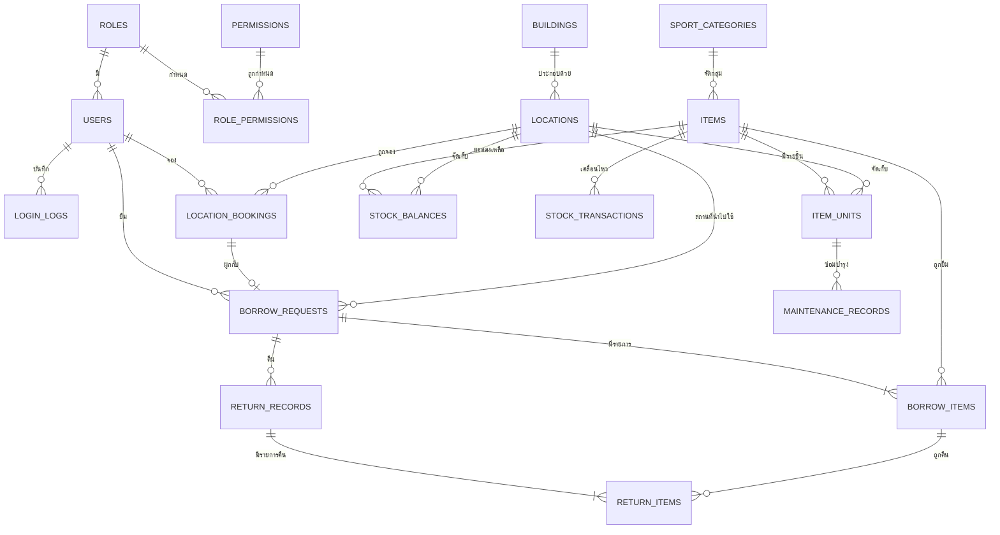

# ระบบจัดการครุภัณฑ์และอุปกรณ์ศูนย์กีฬา
## Sports Center Asset & Equipment Management System — System Design Document

---

## 1. ภาพรวมระบบ (System Overview)

ระบบประกอบด้วย 4 โมดูลหลักที่เชื่อมโยงกันด้วย "รายการอุปกรณ์" และ "สถานที่" เป็นแกนกลาง

```
[Module 1: Auth & Role]  ──> ผู้ใช้ทุกคนในระบบ
         │
         ├──> [Module 2: Stock/Inventory]  <──┐
         │              │                     │ ตรวจสอบจำนวน/สถานะ
         │              ▼                     │
         └──> [Module 3: Borrow & Return] ────┘
                        │
                        │ ผูกกับการจองสถานที่
                        ▼
              [Module 4: Location & Booking]
```

**หลักการออกแบบสำคัญ 3 ข้อ**

1. **แยก "ครุภัณฑ์" ออกจาก "วัสดุสิ้นเปลือง"** — ครุภัณฑ์ (เช่น เครื่องวัดองค์ประกอบร่างกาย, ชุดปีนหน้าผา) ต้องติดตามรายชิ้นด้วยเลขครุภัณฑ์ ส่วนวัสดุ (เช่น ลูกแบดมินตัน, ลูกเทนนิส) ติดตามด้วยจำนวนคงเหลือ → ใช้ตาราง `items` (แม่แบบ) + `item_units` (รายชิ้น)
2. **ทุกการเคลื่อนไหวของ stock ต้องมี log** — ตาราง `stock_transactions` เป็น ledger กลาง ทำให้ยอดคงเหลือตรวจสอบย้อนหลังได้เสมอ
3. **สถานที่มี 2 บทบาท** — เป็นทั้ง "ที่จัดเก็บ" (ห้องสโตร์ A) และ "ที่ใช้งาน/จองได้" (สนามฟุตซอล 1) จึงใช้ตารางเดียวกันแต่แยกด้วย flag `is_storage` / `is_bookable`

---

## 2. หมวดหมู่กีฬา / กิจกรรม (Sport Categories)

ใช้เป็น Master Data ในตาราง `sport_categories` เพื่อจัดกลุ่มอุปกรณ์ สถานที่ และรายงาน

| # | รหัส | หมวดหมู่ | ตัวอย่างอุปกรณ์ในหมวด | สถานที่ที่เกี่ยวข้อง |
|---|------|---------|----------------------|---------------------|
| 1 | TKD | เทควันโด | เกราะ, เป้าเตะ, ฟุตการ์ด, เบาะ, นาฬิกาจับเวลา | ห้องเทควันโด |
| 2 | CLB | ปีนหน้าผา | เชือก, ฮาร์เนส, คาราไบเนอร์, รองเท้าปีนผา, หมวกกันน็อก, ถุงชอล์ก | ผนังปีนหน้าผา |
| 3 | GLF | กอล์ฟ | ไม้กอล์ฟ, ลูกกอล์ฟ, ถุงกอล์ฟ, ตาข่ายซ้อม, เสื่อไดร์ฟ | สนามไดร์ฟกอล์ฟ |
| 4 | FUT | ฟุตซอล | ลูกฟุตซอล, เสื้อทีม, กรวย, ประตูเคลื่อนที่, ตาข่ายประตู | สนามฟุตซอล |
| 5 | FBL | ฟุตบอล | ลูกฟุตบอล, มาร์กเกอร์, บันไดลิง, ธงไลน์แมน, ตาข่ายประตู | สนามฟุตบอล |
| 6 | BKB | บาสเกตบอล | ลูกบาส, ห่วง/แป้นเคลื่อนที่, ตาข่ายห่วง, เครื่องจับเวลา 24 วิ | สนามบาสเกตบอล |
| 7 | TEN | เทนนิส | ไม้เทนนิส, ลูกเทนนิส, ตาข่าย, เครื่องยิงลูก, รถเก็บลูก | คอร์ตเทนนิส |
| 8 | BDM | แบดมินตัน | ไม้แบด, ลูกขนไก่, ตาข่าย, เสาตาข่าย, เก้าอี้กรรมการ | คอร์ตแบดมินตัน |
| 9 | TTN | เทเบิลเทนนิส | โต๊ะปิงปอง, ไม้ปิงปอง, ลูกปิงปอง, ตาข่ายโต๊ะ | ห้องเทเบิลเทนนิส |
| 10 | DAN | เต้น | เครื่องเสียง/ลำโพง, ไมโครโฟน, เสื่อโยคะ, กระจกเคลื่อนที่, ดัมเบลเบา | ห้องเต้น/แอโรบิก |
| 11 | SPS | วิทยาศาสตร์การกีฬา | เครื่องวัดองค์ประกอบร่างกาย, เครื่องวัดแรงบีบมือ, ลู่วิ่งทดสอบ, เครื่องวัดชีพจร, Sit & Reach | ห้องปฏิบัติการวิทย์กีฬา |
| 12 | OFF | อุปกรณ์สำนักงาน | คอมพิวเตอร์, โน้ตบุ๊ก, โปรเจกเตอร์, เครื่องพิมพ์, โต๊ะ-เก้าอี้, เครื่องเสียงประชุม | สำนักงานศูนย์กีฬา |

> หมายเหตุ: ออกแบบให้เพิ่ม/แก้ไขหมวดหมู่ได้จากหน้า Admin (ไม่ hard-code) และรองรับ `parent_category_id` เผื่อทำหมวดย่อยในอนาคต

---

## 3. โครงสร้างฐานข้อมูล (Database Schema)

### 3.1 ER Diagram (ภาพรวมความสัมพันธ์)



---

### 3.2 Module 1 — Login & สิทธิ์การใช้งาน

#### `roles`
| Field | Type | คำอธิบาย |
|---|---|---|
| role_id | PK, INT | |
| role_code | VARCHAR(20) UNIQUE | `ADMIN`, `STAFF`, `MEMBER` |
| role_name | VARCHAR(100) | ผู้ดูแลระบบ / เจ้าหน้าที่ศูนย์กีฬา / สมาชิก |
| description | TEXT | |

#### `permissions`
| Field | Type | คำอธิบาย |
|---|---|---|
| permission_id | PK, INT | |
| permission_code | VARCHAR(50) UNIQUE | เช่น `item.create`, `borrow.approve`, `report.view` |
| module | VARCHAR(30) | auth / stock / borrow / location / report |
| description | VARCHAR(255) | |

#### `role_permissions`
| Field | Type | คำอธิบาย |
|---|---|---|
| role_id | PK, FK → roles | |
| permission_id | PK, FK → permissions | |

#### `users`
| Field | Type | คำอธิบาย |
|---|---|---|
| user_id | PK, INT | |
| username | VARCHAR(50) UNIQUE | |
| password_hash | VARCHAR(255) | เก็บแบบ bcrypt/argon2 เท่านั้น |
| role_id | FK → roles | |
| member_code | VARCHAR(30) | รหัสนักเรียน/รหัสบุคลากร/เลขสมาชิก |
| full_name | VARCHAR(150) | |
| email / phone | VARCHAR | |
| department | VARCHAR(100) | สังกัด/คณะ/แผนก |
| member_type | ENUM | `STUDENT`, `STAFF`, `TEACHER`, `EXTERNAL` |
| borrow_limit | INT | จำนวนรายการสูงสุดที่ยืมพร้อมกันได้ |
| is_blacklisted | BOOLEAN | ระงับสิทธิ์ยืม (เช่น คืนช้าเกินเกณฑ์) |
| status | ENUM | `ACTIVE`, `INACTIVE`, `SUSPENDED` |
| last_login_at, created_at, updated_at | DATETIME | |

#### `login_logs`
| Field | Type | คำอธิบาย |
|---|---|---|
| log_id | PK, BIGINT | |
| user_id | FK → users (nullable) | |
| action | ENUM | `LOGIN_SUCCESS`, `LOGIN_FAIL`, `LOGOUT` |
| ip_address / user_agent | VARCHAR | |
| created_at | DATETIME | |

#### `audit_logs` (แนะนำให้มี — ตรวจสอบย้อนหลังงานราชการ)
`audit_id, user_id, table_name, record_id, action(CREATE/UPDATE/DELETE), old_value(JSON), new_value(JSON), created_at`

---

### 3.3 Module 2 — Stock / คลังอุปกรณ์

#### `sport_categories`
| Field | Type | คำอธิบาย |
|---|---|---|
| category_id | PK, INT | |
| category_code | VARCHAR(10) UNIQUE | TKD, CLB, GLF, ... |
| category_name | VARCHAR(100) | |
| parent_category_id | FK → sport_categories (nullable) | รองรับหมวดย่อย |
| icon / color | VARCHAR | ใช้ตกแต่ง UI |
| is_active | BOOLEAN | |

#### `items` (แม่แบบรายการอุปกรณ์)
| Field | Type | คำอธิบาย |
|---|---|---|
| item_id | PK, INT | |
| item_code | VARCHAR(30) UNIQUE | เช่น `BDM-RKT-001` |
| item_name | VARCHAR(200) | |
| category_id | FK → sport_categories | |
| item_type | ENUM | `DURABLE` (ครุภัณฑ์) / `CONSUMABLE` (วัสดุ) |
| is_serialized | BOOLEAN | TRUE = ติดตามรายชิ้นใน `item_units` |
| unit_of_measure | VARCHAR(20) | ชิ้น / อัน / คู่ / กล่อง / ชุด |
| brand / model | VARCHAR(100) | |
| image_url | VARCHAR(255) | |
| default_location_id | FK → locations | ที่จัดเก็บหลัก |
| min_stock_alert | INT | จุดสั่งซื้อ/แจ้งเตือนของใกล้หมด |
| is_borrowable | BOOLEAN | บางรายการห้ามยืมออกนอกศูนย์ |
| max_borrow_days | INT | ระยะเวลายืมสูงสุดของรายการนี้ |
| require_approval | BOOLEAN | ต้องผ่านการอนุมัติเจ้าหน้าที่หรือไม่ |
| description, created_at, updated_at | | |

#### `item_units` (ครุภัณฑ์รายชิ้น)
| Field | Type | คำอธิบาย |
|---|---|---|
| unit_id | PK, INT | |
| item_id | FK → items | |
| asset_number | VARCHAR(50) UNIQUE | เลขครุภัณฑ์ทางการ |
| serial_number | VARCHAR(100) | S/N ของผู้ผลิต |
| qr_code | VARCHAR(100) UNIQUE | ใช้สแกนยืม-คืน |
| current_location_id | FK → locations | ตำแหน่งจัดเก็บปัจจุบัน |
| status | ENUM | `AVAILABLE`, `BORROWED`, `RESERVED`, `REPAIRING`, `DAMAGED`, `LOST`, `DISPOSED` |
| condition_grade | ENUM | `A` ดีมาก / `B` ดี / `C` พอใช้ / `D` ชำรุด |
| purchase_date, purchase_price, budget_year | | ข้อมูลพัสดุ |
| warranty_expire_date | DATE | |
| supplier | VARCHAR(150) | |
| note | TEXT | |

#### `stock_balances` (ยอดคงเหลือแยกตามที่จัดเก็บ — สำหรับวัสดุ)
| Field | Type | คำอธิบาย |
|---|---|---|
| balance_id | PK | |
| item_id | FK → items | |
| location_id | FK → locations | |
| qty_total | INT | ทั้งหมดที่มี |
| qty_available | INT | พร้อมใช้งาน |
| qty_borrowed | INT | ถูกยืมอยู่ |
| qty_damaged | INT | ชำรุด/รอซ่อม |
| updated_at | DATETIME | |
| | UNIQUE(item_id, location_id) | |

#### `stock_transactions` (Ledger กลาง — ทุกการเคลื่อนไหว)
| Field | Type | คำอธิบาย |
|---|---|---|
| trx_id | PK, BIGINT | |
| trx_type | ENUM | `RECEIVE` รับเข้า, `ISSUE` เบิกออก, `BORROW`, `RETURN`, `TRANSFER` ย้ายที่เก็บ, `ADJUST` ปรับยอด, `REPAIR_OUT`, `REPAIR_IN`, `DISPOSE` |
| item_id | FK → items | |
| unit_id | FK → item_units (nullable) | |
| qty | INT | +/- ตามทิศทาง |
| location_from_id / location_to_id | FK → locations | |
| ref_type | VARCHAR(30) | `BORROW_REQUEST`, `RETURN`, `MAINTENANCE`, `MANUAL` |
| ref_id | INT | อ้างอิงเอกสารต้นทาง |
| performed_by | FK → users | |
| note | TEXT | |
| trx_date | DATETIME | |

#### `maintenance_records` (ประวัติซ่อมบำรุง)
| Field | Type | คำอธิบาย |
|---|---|---|
| maintenance_id | PK | |
| item_id / unit_id | FK | |
| reported_by | FK → users | |
| report_date | DATETIME | |
| problem_description | TEXT | |
| damage_source | ENUM | `USAGE`, `BORROW_RETURN`, `INSPECTION` |
| ref_return_item_id | FK → return_items (nullable) | เชื่อมกับการคืนที่พบความเสียหาย |
| action_taken | TEXT | |
| vendor | VARCHAR(150) | |
| cost | DECIMAL(10,2) | |
| status | ENUM | `REPORTED`, `IN_REPAIR`, `COMPLETED`, `CANNOT_REPAIR`, `DISPOSED` |
| completed_date | DATE | |

#### `notifications` (ศูนย์กลางการแจ้งเตือน)
| Field | Type | คำอธิบาย |
|---|---|---|
| notification_id | PK | |
| type | ENUM | `LOW_STOCK`, `DAMAGED_ITEM`, `DUE_SOON`, `OVERDUE`, `REQUEST_PENDING`, `REQUEST_APPROVED`, `REQUEST_REJECTED`, `BOOKING_CONFIRMED` |
| title / message | VARCHAR / TEXT | |
| ref_type / ref_id | | ลิงก์ไปยังเอกสารที่เกี่ยวข้อง |
| target_user_id | FK → users (nullable) | |
| target_role_id | FK → roles (nullable) | แจ้งทั้งบทบาท เช่น STAFF ทุกคน |
| priority | ENUM | `LOW`, `NORMAL`, `HIGH` |
| is_read | BOOLEAN | |
| created_at | DATETIME | |

---

### 3.4 Module 3 — ยืม-คืน

#### `borrow_requests` (ใบยืม — header)
| Field | Type | คำอธิบาย |
|---|---|---|
| request_id | PK | |
| request_no | VARCHAR(30) UNIQUE | เช่น `BR-2569-00123` |
| borrower_id | FK → users | **ใคร** ยืม |
| purpose | TEXT | วัตถุประสงค์ (เรียนการสอน / แข่งขัน / ซ้อม / กิจกรรม) |
| usage_location_id | FK → locations | **สถานที่นำไปใช้** |
| external_location | VARCHAR(255) | กรณีนำออกนอกศูนย์ (ระบุเป็นข้อความ) |
| booking_id | FK → location_bookings (nullable) | **ผูกกับการจองสถานที่** |
| borrow_date | DATETIME | วันเวลาที่ยืม |
| due_date | DATETIME | กำหนดส่งคืน |
| actual_return_date | DATETIME | วันคืนจริง (ล่าสุด) |
| status | ENUM | `DRAFT`, `PENDING`, `APPROVED`, `REJECTED`, `BORROWED`, `PARTIAL_RETURNED`, `RETURNED`, `OVERDUE`, `CANCELLED` |
| approved_by | FK → users | |
| approved_at | DATETIME | |
| reject_reason | TEXT | |
| issued_by | FK → users | เจ้าหน้าที่ผู้จ่ายของ |
| received_by | FK → users | เจ้าหน้าที่ผู้รับคืน |
| total_penalty | DECIMAL(10,2) | ค่าปรับรวม |
| note | TEXT | |
| created_at, updated_at | | |

#### `borrow_items` (รายการที่ยืม — detail)
| Field | Type | คำอธิบาย |
|---|---|---|
| borrow_item_id | PK | |
| request_id | FK → borrow_requests | |
| item_id | FK → items | **ยืมอะไร** |
| unit_id | FK → item_units (nullable) | ระบุชิ้นเมื่อเป็นครุภัณฑ์ |
| qty_requested | INT | |
| qty_approved | INT | |
| qty_returned | INT | ยอดสะสมที่คืนแล้ว |
| condition_before | ENUM | สภาพก่อนยืม `A/B/C/D` |
| photo_before_url | VARCHAR(255) | ภาพถ่ายก่อนส่งมอบ |
| line_status | ENUM | `PENDING`, `ISSUED`, `RETURNED`, `PARTIAL`, `DAMAGED`, `LOST` |

#### `return_records` (ใบคืน — header, รองรับทยอยคืน)
| Field | Type | คำอธิบาย |
|---|---|---|
| return_id | PK | |
| return_no | VARCHAR(30) UNIQUE | |
| request_id | FK → borrow_requests | |
| return_date | DATETIME | |
| returned_by | FK → users | ผู้นำมาคืน |
| received_by | FK → users | เจ้าหน้าที่ผู้ตรวจรับ |
| is_late | BOOLEAN | |
| late_days | INT | |
| overall_note | TEXT | |

#### `return_items` (รายการคืน + ผลตรวจสภาพ)
| Field | Type | คำอธิบาย |
|---|---|---|
| return_item_id | PK | |
| return_id | FK → return_records | |
| borrow_item_id | FK → borrow_items | |
| unit_id | FK → item_units (nullable) | |
| qty_returned | INT | |
| condition_after | ENUM | `GOOD` สมบูรณ์, `MINOR_DAMAGE` ชำรุดเล็กน้อย, `MAJOR_DAMAGE` ชำรุดหนัก, `LOST` สูญหาย |
| damage_note | TEXT | |
| photo_after_url | VARCHAR(255) | |
| post_action | ENUM | `RESTOCK` เข้าคลัง, `SEND_REPAIR` ส่งซ่อม, `DISPOSE` ตัดจำหน่าย |
| penalty_amount | DECIMAL(10,2) | ค่าปรับ/ค่าชดใช้ |
| inspected_by | FK → users | |

#### `penalties` (ตัวเลือกเสริม — จัดการค่าปรับ/ชดใช้)
`penalty_id, request_id, return_item_id, user_id, penalty_type(LATE/DAMAGE/LOST), amount, status(UNPAID/PAID/WAIVED), paid_at, note`

---

### 3.5 Module 4 — จัดการสถานที่

#### `buildings`
| Field | Type | คำอธิบาย |
|---|---|---|
| building_id | PK | |
| building_code | VARCHAR(20) | `GYM1`, `GYM2`, `OFFICE` |
| building_name | VARCHAR(150) | เช่น อาคารยิมเนเซียม 1 |
| address / map_url | VARCHAR | |
| is_active | BOOLEAN | |

#### `locations`
| Field | Type | คำอธิบาย |
|---|---|---|
| location_id | PK | |
| building_id | FK → buildings | |
| parent_location_id | FK → locations (nullable) | รองรับ ชั้น → ห้อง → ชั้นวาง |
| location_code | VARCHAR(30) UNIQUE | `STORE-A`, `GYM1-FUTSAL-01` |
| location_name | VARCHAR(150) | เช่น ห้องสโตร์ A, สนามฟุตซอล 1 |
| location_type | ENUM | `STORE` ห้องเก็บของ, `SHELF` ชั้นวาง, `COURT` คอร์ต/สนามในร่ม, `FIELD` สนามกลางแจ้ง, `ROOM` ห้องกิจกรรม, `OFFICE` |
| category_id | FK → sport_categories (nullable) | หมวดกีฬาประจำสถานที่ |
| is_storage | BOOLEAN | ใช้เป็นที่จัดเก็บอุปกรณ์ได้ |
| is_bookable | BOOLEAN | เปิดให้จองใช้งานได้ |
| capacity | INT | ความจุ (คน) |
| open_time / close_time | TIME | เวลาทำการ |
| responsible_user_id | FK → users | เจ้าหน้าที่ผู้ดูแลสถานที่ |
| status | ENUM | `ACTIVE`, `MAINTENANCE`, `CLOSED` |

#### `location_bookings` (การจองใช้สถานที่)
| Field | Type | คำอธิบาย |
|---|---|---|
| booking_id | PK | |
| booking_no | VARCHAR(30) UNIQUE | `BK-2569-00456` |
| location_id | FK → locations | |
| user_id | FK → users | ผู้จอง |
| category_id | FK → sport_categories | กิจกรรมที่ใช้ |
| activity_name | VARCHAR(200) | เช่น "ซ้อมทีมบาสเกตบอล" |
| start_datetime / end_datetime | DATETIME | |
| participant_count | INT | |
| status | ENUM | `PENDING`, `APPROVED`, `REJECTED`, `IN_USE`, `COMPLETED`, `CANCELLED` |
| approved_by | FK → users | |
| note | TEXT | |
| created_at | DATETIME | |

> **จุดเชื่อมสำคัญ:** `borrow_requests.booking_id` → `location_bookings.booking_id`
> ทำให้เมื่อสมาชิกจองคอร์ตแบดมินตัน 18:00–20:00 แล้วยืมไม้แบด ระบบจะ (1) ตั้ง `borrow_date`/`due_date` ตามช่วงเวลาจองอัตโนมัติ (2) เตือนเจ้าหน้าที่ถ้าถึงเวลาเลิกใช้แล้วยังไม่คืน

---

## 4. Core Functions แต่ละโมดูล

### 4.1 Module 1 — Login & สิทธิ์การใช้งาน

| # | ฟังก์ชัน | รายละเอียด | สิทธิ์ |
|---|---------|-----------|-------|
| 1.1 | `login()` | ตรวจ username/password (hash), ออก JWT/Session, บันทึก `login_logs`, ล็อกบัญชีเมื่อผิดเกิน 5 ครั้ง | ทุกคน |
| 1.2 | `logout()` | ทำลาย session/token | ทุกคน |
| 1.3 | `register()` / `approveMember()` | สมัครสมาชิก → สถานะ `INACTIVE` รอเจ้าหน้าที่อนุมัติ | Member / Staff |
| 1.4 | `resetPassword()` | ส่งลิงก์รีเซ็ตทางอีเมล มีวันหมดอายุ | ทุกคน |
| 1.5 | `manageUsers()` | CRUD ผู้ใช้ กำหนดบทบาท ระงับ/ปลดระงับสิทธิ์ | Admin |
| 1.6 | `manageRolePermissions()` | ผูกสิทธิ์รายฟังก์ชันกับบทบาท (RBAC) | Admin |
| 1.7 | `checkPermission(code)` | Middleware ตรวจสิทธิ์ก่อนเข้าถึงทุก API | ระบบ |
| 1.8 | `viewProfile()` / `updateProfile()` | ดู/แก้ไขข้อมูลส่วนตัว + ประวัติการยืมของตนเอง | ทุกคน |
| 1.9 | `viewAuditLog()` | ดูประวัติการแก้ไขข้อมูลสำคัญ | Admin |

**ตารางสิทธิ์โดยสรุป**

| ความสามารถ | Admin | Staff | Member |
|---|:---:|:---:|:---:|
| จัดการผู้ใช้/สิทธิ์ | ✔ | ✘ | ✘ |
| เพิ่ม/แก้ไข/ลบ ครุภัณฑ์ | ✔ | ✔ | ✘ |
| ดูรายการ & จำนวนคงเหลือ | ✔ | ✔ | ✔ |
| อนุมัติคำขอยืม | ✔ | ✔ | ✘ |
| จ่ายของ / รับคืน / ตรวจสภาพ | ✔ | ✔ | ✘ |
| ยื่นคำขอยืม | ✔ | ✔ | ✔ |
| จองสถานที่ | ✔ | ✔ | ✔ |
| อนุมัติการจองสถานที่ | ✔ | ✔ | ✘ |
| บันทึกซ่อม/ตัดจำหน่าย | ✔ | ✔ | ✘ |
| รายงาน & Dashboard | ✔ | ✔ | เฉพาะของตนเอง |

---

### 4.2 Module 2 — เช็ค Stock / คลังอุปกรณ์

| # | ฟังก์ชัน | รายละเอียด |
|---|---------|-----------|
| 2.1 | `listItems(filter)` | แสดงรายการทั้งหมด กรองตามหมวดกีฬา / สถานะ / สถานที่จัดเก็บ / คำค้น พร้อม pagination |
| 2.2 | `getItemDetail(id)` | ข้อมูลอุปกรณ์ + รายชิ้น (ครุภัณฑ์) + ยอดคงเหลือแยกที่เก็บ + ประวัติยืม + ประวัติซ่อม |
| 2.3 | `createItem()` / `updateItem()` / `deactivateItem()` | CRUD แม่แบบอุปกรณ์ (ไม่ลบถาวร ใช้ soft delete เพื่อคงประวัติ) |
| 2.4 | `addItemUnits()` | เพิ่มครุภัณฑ์รายชิ้น กำหนดเลขครุภัณฑ์ + สร้าง QR Code อัตโนมัติ |
| 2.5 | `receiveStock(qty)` | รับของเข้าคลัง → บันทึก `stock_transactions (RECEIVE)` → อัปเดต `stock_balances` |
| 2.6 | `adjustStock()` | ปรับยอดจากการตรวจนับประจำปี (ต้องระบุเหตุผล + log เสมอ) |
| 2.7 | `transferStock()` | ย้ายที่จัดเก็บ เช่น สโตร์ A → สโตร์ B |
| 2.8 | `updateItemStatus()` | เปลี่ยนสถานะรายชิ้น (พร้อมใช้ / ชำรุด / ส่งซ่อม / สูญหาย / ตัดจำหน่าย) |
| 2.9 | `reportDamage()` | แจ้งชำรุด → สร้าง `maintenance_records` + แจ้งเตือนเจ้าหน้าที่ + ตัดออกจากยอด available |
| 2.10 | `manageMaintenance()` | ติดตามสถานะซ่อม บันทึกค่าใช้จ่าย/ผู้รับจ้าง และคืนของเข้าคลังเมื่อซ่อมเสร็จ |
| 2.11 | `checkAvailability(itemId, from, to)` | คำนวณจำนวนที่ยืมได้จริงในช่วงเวลา = คงเหลือ − ที่จองล่วงหน้าไว้แล้ว |
| 2.12 | `runStockAlerts()` | **Scheduled job** ตรวจและสร้างการแจ้งเตือน (ดูเกณฑ์ข้อ 5) |
| 2.13 | `scanQR(code)` | สแกน QR/บาร์โค้ด → เปิดหน้ารายละเอียด/ยืม/คืน ทันที |
| 2.14 | `exportInventory()` | ออกรายงานทะเบียนครุภัณฑ์เป็น Excel/PDF (ใช้ตรวจนับพัสดุประจำปี) |

---

### 4.3 Module 3 — ยืม-คืน

**Flow หลัก**
```
Member ยื่นคำขอ → PENDING → Staff อนุมัติ → APPROVED
   → Staff จ่ายของ (บันทึกสภาพก่อนยืม) → BORROWED
   → ถึงกำหนด → แจ้งเตือน → เกินกำหนด → OVERDUE
   → คืน + ตรวจสภาพ → RETURNED (หรือ PARTIAL_RETURNED ถ้าคืนไม่ครบ)
        └─ ถ้าพบชำรุด → สร้างใบซ่อม + คิดค่าปรับ
```

| # | ฟังก์ชัน | รายละเอียด |
|---|---------|-----------|
| 3.1 | `createBorrowRequest()` | เลือกอุปกรณ์ (หลายรายการ/ใบ), ระบุวันยืม-กำหนดคืน, วัตถุประสงค์, สถานที่นำไปใช้, เลือกผูกกับ booking ได้ |
| 3.2 | `validateBorrowRules()` | ตรวจ: ของพอหรือไม่ / ผู้ยืมถูก blacklist หรือมีของค้างคืนไหม / เกิน `borrow_limit` ไหม / เกิน `max_borrow_days` ไหม |
| 3.3 | `approveRequest()` / `rejectRequest()` | เจ้าหน้าที่อนุมัติ (ปรับจำนวนที่อนุมัติได้) หรือปฏิเสธพร้อมเหตุผล → แจ้งเตือนผู้ยืม |
| 3.4 | `issueItems()` | จ่ายของจริง: สแกน QR เลือกชิ้น, บันทึกสภาพ + ภาพถ่ายก่อนยืม, ตัด stock, เปลี่ยน `item_units.status = BORROWED` |
| 3.5 | `returnItems()` | รับคืน (ทั้งหมดหรือบางส่วน) บันทึก `return_records` + `return_items` |
| 3.6 | `inspectCondition()` | **เช็คสภาพหลังใช้งาน**: เลือก `condition_after` + หมายเหตุ + แนบรูป → ระบบกำหนด `post_action` อัตโนมัติ |
| 3.7 | `calculatePenalty()` | ค่าปรับคืนช้า (บาท/วัน) + ค่าชดใช้กรณีชำรุด/สูญหาย |
| 3.8 | `extendDueDate()` | ขอต่ออายุการยืม (ต้องไม่มีคิวจองต่อ และต้องได้รับอนุมัติ) |
| 3.9 | `cancelRequest()` | ยกเลิกก่อนรับของ → คืนจำนวนที่กันไว้เข้าระบบ |
| 3.10 | `listBorrowHistory()` | ประวัติการยืมแยกตามผู้ใช้ / อุปกรณ์ / ช่วงเวลา / สถานะ |
| 3.11 | `trackOverdue()` | **Scheduled job** อัปเดตสถานะ `OVERDUE` + ส่งแจ้งเตือนผู้ยืมและเจ้าหน้าที่ |
| 3.12 | `printBorrowSlip()` | พิมพ์ใบยืม/ใบคืน (PDF) พร้อมช่องลงนามสำหรับงานพัสดุ |

**กติกาสำคัญที่ควร enforce ใน transaction เดียว (ACID)**
เมื่อจ่ายของหรือรับคืน ต้องอัปเดต `stock_balances` + `item_units.status` + `borrow_items` + `stock_transactions` พร้อมกัน ถ้าขั้นใดล้มเหลวให้ rollback ทั้งหมด

---

### 4.4 Module 4 — จัดการสถานที่

| # | ฟังก์ชัน | รายละเอียด |
|---|---------|-----------|
| 4.1 | `manageBuildings()` / `manageLocations()` | CRUD อาคารและสถานที่ย่อย รองรับโครงสร้างลำดับชั้น |
| 4.2 | `assignItemLocation()` | กำหนด/ย้ายตำแหน่งจัดเก็บของอุปกรณ์แต่ละชิ้น |
| 4.3 | `viewLocationInventory()` | ดูว่าในห้องสโตร์ A มีอะไรเก็บอยู่บ้าง จำนวนเท่าไร (ใช้ตรวจนับ) |
| 4.4 | `checkLocationAvailability()` | ตรวจว่าสถานที่ว่างในช่วงเวลาที่ต้องการหรือไม่ (ป้องกันจองชนกัน) |
| 4.5 | `createBooking()` | จองใช้สถานที่: ระบุกิจกรรม/หมวดกีฬา ช่วงเวลา จำนวนผู้เข้าร่วม |
| 4.6 | `approveBooking()` | เจ้าหน้าที่อนุมัติ/ปฏิเสธการจอง → แจ้งเตือนผู้จอง |
| 4.7 | `linkBorrowToBooking()` | **ผูกใบยืมเข้ากับการจอง** → เติมวันเวลายืม-คืนจากช่วงเวลาจองอัตโนมัติ |
| 4.8 | `suggestEquipmentByLocation()` | แนะนำอุปกรณ์ที่เหมาะกับสถานที่/หมวดกีฬาที่จอง (เช่น จองคอร์ตแบด → เสนอไม้แบด+ลูกขนไก่) |
| 4.9 | `viewBookingCalendar()` | ปฏิทินรายวัน/สัปดาห์/เดือน แยกตามสถานที่ |
| 4.10 | `setLocationMaintenance()` | ปิดสถานที่ชั่วคราวเพื่อซ่อมบำรุง → บล็อกการจองช่วงนั้น |

---

## 5. เกณฑ์การแจ้งเตือน (Alert Rules)

| ประเภท | เงื่อนไขทริกเกอร์ | แจ้งใคร | ความถี่ |
|---|---|---|---|
| ของใกล้หมด | `qty_available <= min_stock_alert` | Staff, Admin | ทุกครั้งที่ stock เปลี่ยน + สรุปทุกเช้า |
| ของหมด | `qty_available = 0` | Staff, Admin | ทันที (priority HIGH) |
| อุปกรณ์ชำรุด | สถานะเปลี่ยนเป็น `DAMAGED`/`REPAIRING` | Staff, Admin | ทันที |
| ใกล้ครบกำหนดคืน | `due_date - now <= 24 ชม.` | ผู้ยืม | วันละครั้ง |
| เกินกำหนดคืน | `now > due_date` และยังไม่คืนครบ | ผู้ยืม + Staff | ทุกวันจนกว่าจะคืน |
| มีคำขอรออนุมัติ | สร้าง request ใหม่ | Staff | ทันที |
| ผลอนุมัติ | approve/reject | ผู้ยืม | ทันที |
| ประกันหมดอายุ | `warranty_expire_date - now <= 30 วัน` | Admin | เดือนละครั้ง |
| ครุภัณฑ์ไม่ถูกใช้นาน | ไม่มีการยืมเกิน 12 เดือน | Admin | รายงานประจำปี |

ช่องทางแจ้งเตือน: In-app (bell icon) → Email → LINE Notify / LINE OA (เหมาะกับบริบทไทยมากที่สุด)

---

## 6. Dashboard & รายงานที่ควรมี

**Dashboard เจ้าหน้าที่**
- การ์ดสรุป: อุปกรณ์ทั้งหมด / พร้อมใช้ / ถูกยืม / ชำรุด / เกินกำหนดคืน
- กราฟแท่ง: จำนวนการยืมแยกตามหมวดกีฬา (รายเดือน)
- ตาราง: รายการเกินกำหนดคืน + รายการใกล้หมด (actionable)
- ปฏิทินการจองสถานที่วันนี้

**รายงาน (Export Excel/PDF)**
1. ทะเบียนครุภัณฑ์ทั้งหมด (แยกตามหมวด/สถานที่) — ใช้ตรวจนับพัสดุประจำปี
2. รายงานการยืม-คืน ตามช่วงเวลา/ผู้ยืม/หน่วยงาน
3. รายงานอุปกรณ์ชำรุดและค่าใช้จ่ายซ่อมบำรุง
4. รายงานอัตราการใช้งาน (Utilization Rate) รายอุปกรณ์/รายสถานที่ → ใช้ประกอบการของบประมาณจัดซื้อ
5. รายงานผู้ยืมค้างคืน/ค่าปรับค้างชำระ

---

## 7. ข้อเสนอแนะด้านเทคนิค

| ส่วน | ตัวเลือกที่แนะนำ | เหตุผล |
|---|---|---|
| Database | **MySQL 8 / PostgreSQL 15** | รองรับ transaction, FK, JSON column สำหรับ audit log |
| Backend | Laravel (PHP) หรือ NestJS/Express (Node.js) | Laravel มี RBAC, queue, scheduler ครบ เหมาะกับงานสถานศึกษาไทยที่มักใช้ PHP hosting |
| Frontend | React / Next.js + Tailwind หรือ Vue 3 | ต้องการ Responsive สูงเพราะเจ้าหน้าที่ใช้มือถือสแกน QR ที่หน้าสโตร์ |
| Auth | JWT + Refresh Token, bcrypt/argon2 | |
| QR/Barcode | `qrcode` (สร้าง) + `html5-qrcode` (สแกนผ่านกล้องมือถือ) | ลดเวลาจ่าย-รับของอย่างมาก |
| Job Scheduler | Cron / Laravel Scheduler | สำหรับ `trackOverdue()` และ `runStockAlerts()` |
| File Storage | เก็บรูปสภาพอุปกรณ์ก่อน-หลังยืม | หลักฐานสำคัญเวลาเกิดข้อพิพาทเรื่องความเสียหาย |

**Index ที่ควรสร้าง (ผลต่อ performance ชัดเจน)**
```sql
CREATE INDEX idx_items_category      ON items(category_id);
CREATE INDEX idx_units_item_status   ON item_units(item_id, status);
CREATE INDEX idx_units_location      ON item_units(current_location_id);
CREATE INDEX idx_borrow_status_due   ON borrow_requests(status, due_date);
CREATE INDEX idx_borrow_borrower     ON borrow_requests(borrower_id, borrow_date);
CREATE INDEX idx_trx_item_date       ON stock_transactions(item_id, trx_date);
CREATE INDEX idx_booking_loc_time    ON location_bookings(location_id, start_datetime, end_datetime);
```

---

## 8. ลำดับการพัฒนาที่แนะนำ (Development Roadmap)

| Phase | ขอบเขต | ผลลัพธ์ |
|---|---|---|
| **1** | Master Data: users, roles, sport_categories, buildings, locations, items, item_units | มีทะเบียนครุภัณฑ์ใช้งานได้จริง |
| **2** | Auth + RBAC + จัดการ Stock (รับเข้า/ปรับยอด/ย้าย/แจ้งชำรุด) | ระบบคลังสมบูรณ์ |
| **3** | ยืม-คืน ครบ flow + ตรวจสภาพ + QR Scan | ฟังก์ชันหลักที่สุดของระบบ |
| **4** | จองสถานที่ + ผูกกับใบยืม + ปฏิทิน | เชื่อมโยง 4 โมดูลครบ |
| **5** | Notification, Dashboard, รายงาน export, ค่าปรับ | พร้อมใช้งานจริงเต็มรูปแบบ |

---

*เอกสารนี้เป็นแบบร่างเชิงออกแบบ (Design Draft) สามารถปรับ field และ ENUM ให้ตรงกับระเบียบพัสดุของหน่วยงานได้*
